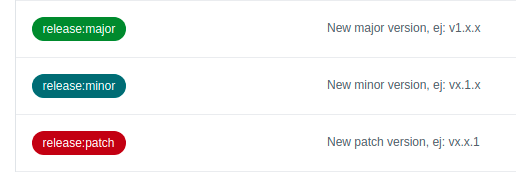
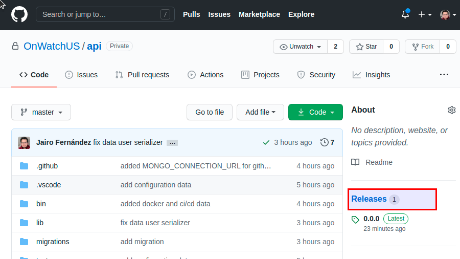
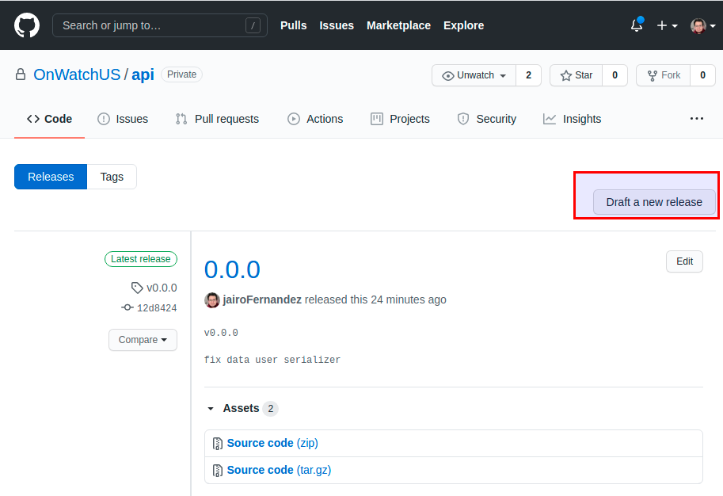
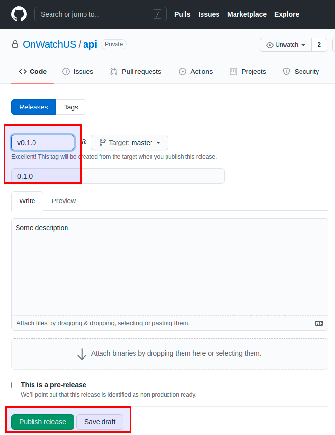
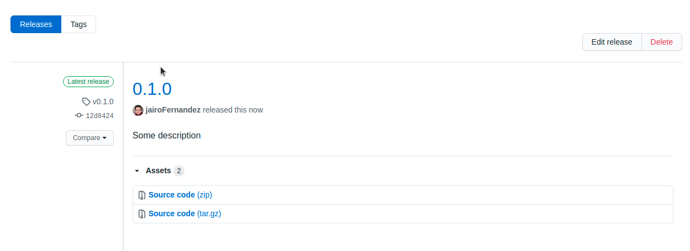

When we need to deploy a repository, we can use a Label in your PR

---
## Using a PR for generate a release

This is the **supported options:**

- **release:major**: Generate a major release, with the structure **v1**.xx
- **release:minor**: Generate a minor release, with the structure v1.**x**.x
- **release:patch**: Generate a patch release, with the structure v1.x.**x**

##### Example:

1. We need to deploy a new release

----

## Create a release manually
If we need to create a release manually:

1. Go to **"Release" menu**:

2. Go to **"Draft a new release"**

3. Add the name and **"Publish"** or **"Save draft"**

4. This is the result

