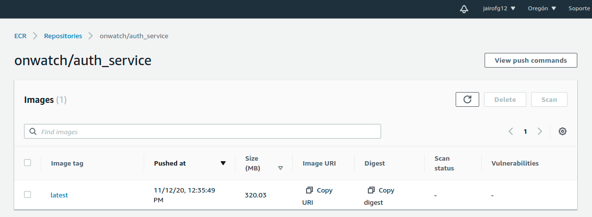

## Introduction

When a **[Pipeline](/docs/guide/pipeline)** is completed, an "artifact" is generated by a series of defined steps.

The most common strategy is to use **docker images** to be able to display the results with greater security and being sure that the generated **code runs equally in development as in the production environment**

For this projects, the docker images is published on <a href="https://aws.amazon.com/ecr/?nc1=h_ls" target="_blank">**AWS Elastic Container Registry (ECR)**</a>



To manage the creation of the repositories in AWS-ECR, we will use <a href="https://www.terraform.io/" target="_blank">**Terraform**</a>

---
### Repository for infrastructure
This repo contains the configurations used:

<a href="https://github.com/OnWatchUS/infrastructure/tree/master/01-ecr" target="_blank">**`OnWatchUS/infrastructure/tree/master/01-ecr`**</a>

**Remember**: You user must be part of "Dev" Team of github org.

***
This is the default github action for generate a Docker image:

```yaml
  build-and-push:
    name: Create docker image
    runs-on: ubuntu-latest
    needs: build
    steps:
      - uses: actions/checkout@v1
      - uses: kciter/aws-ecr-action@v1
        with:
          access_key_id: ${{ secrets.AWS_ACCESS_KEY_ID }}
          secret_access_key: ${{ secrets.AWS_SECRET_ACCESS_KEY }}
          account_id: ${{ secrets.AWS_ACCOUNT_ID }}
          repo: onwatch/NAME_REPOSITORY
          region: us-west-2
          tags: NAME_OR_TAG,${{ github.sha }}
          create_repo: false
```

The vars `AWS_ACCESS_KEY_ID`, `AWS_SECRET_ACCESS_KEY`, `AWS_ACCOUNT_ID` are required, and the IAM Role requires a ECR permissions.

The var `NAME_OR_TAG`, is usually latest, qa.

