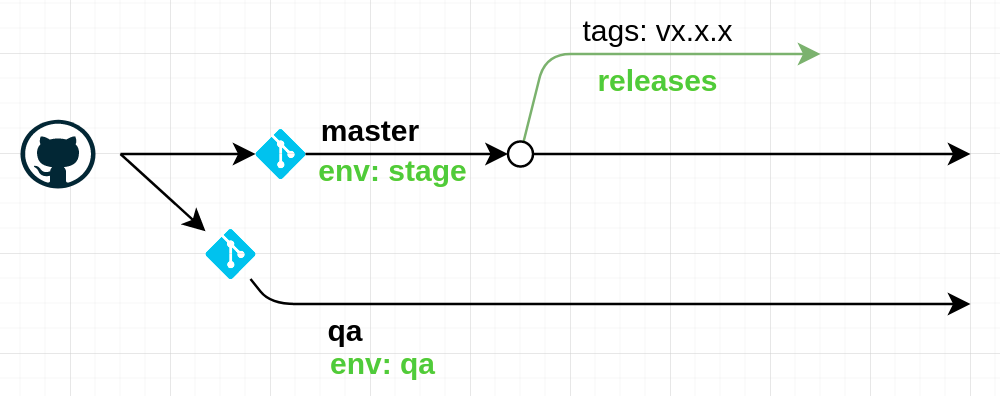

The system used for pipelines is <a href="https://github.com/features/actions" target="_blank">**Github actions**</a>, the avantage is the same repository the code and the task for CI/CD.

The common structure for use this actions, is located a `.github/workflows`, and It's corresponding to git branches.

When the dev push changes to specific branches (master, qa) through of <a href="https://docs.github.com/en/free-pro-team@latest/github/collaborating-with-issues-and-pull-requests/about-pull-requests" target="_blank">**Pull request (PR)**</a>,

The most simple structure or steps when a PR start:
1. Provisioning an environment compatible for the specific project (dart, flutter, reactjs, RoR, etc).
2. Run a Test battery for verify the new changes
3. Generate an **[Artifacts](https://onwatchus.github.io/documentation/docs/guide/artifacts)** with the code. (CI)
4. Deploy the changes in a production/stage/qa environment. (CD)
